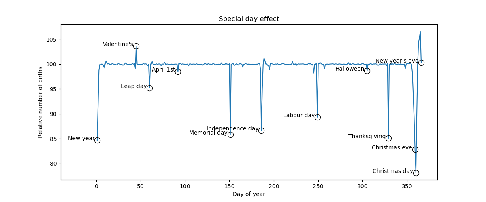

Example: Hilbert space approximation for Gaussian processes.
============================================================

This example replicates a few of the models in the excellent case
study by Aki Vehtari [1] (originally written using R and Stan).
The case study uses approximate Gaussian processes [2] to model the
relative number of births per day in the US from 1969 to 1988.
The Hilbert space approximation is way faster than the exact Gaussian
processes because it circumvents the need for inverting the
covariance matrix.

The original case study presented by Aki also emphasizes the iterative
process of building a Bayesian model, which is excellent as a pedagogical
resource. Here, however, I replicate only 4 out of all the models available in [1].
There are a few minor differences in the mathematical details of my model GP4,
which I had to make in order for the chains to mix properly. I have clearly
commented on the places where our models are different.

The available models are:
1. `t` -- Only a long term trend process.
2. `ty` -- Long term trend with year seasonal effect.
3. `tyw` -- Long term trend with year seasonal effect and a day-of-week effect that varies slowly over the years.
4. `tywd` -- Long term trend with year seasonal effect, a day-of-week effect that varies slowly over the years, and a special days effect, including floating special days.

The equivalent model in the original case study [1] are:
* `t`: Same as "Model 1: Slow trend"
* `ty`: Same as "Model 2: Slow trend + yearly seasonal trend"
* `tyw`: _Similar_ to "Model 4: long term smooth + seasonal + weekday with increasing magnitude". The difference is that I used a sum-to-zero constrain for the day-of-week effect rather than setting the effect of Mondays to zero.
* `tywd`: _Similar_ to "Model 8+RHS: day of year effect with RHS prior". The difference is that I used `slab_scale=50` instead of `100`. I initially tried it with a value of 50 but found that my chains were getting stuck at the initialization point. Another difference is that there seems to be a mistake in the code of the original blogpost because the prior of β4 appears duplicated (it has a first a normal prior and then a horseshoe prior). I'm pretty confident this is a typo so I've not included the duplicated prior, I only use the horseshoe prior.

#### References:
1. Gelman, Vehtari, Simpson, et al (2020), "Bayesian workflow book - Birthdays<https://avehtari.github.io/casestudies/Birthdays/birthdays.html>.
2. Riutort-Mayol G, Bürkner PC, Andersen MR, et al (2020), "Practical Hilbert space approximate bayesian gaussian processes for probabilistic programming"

